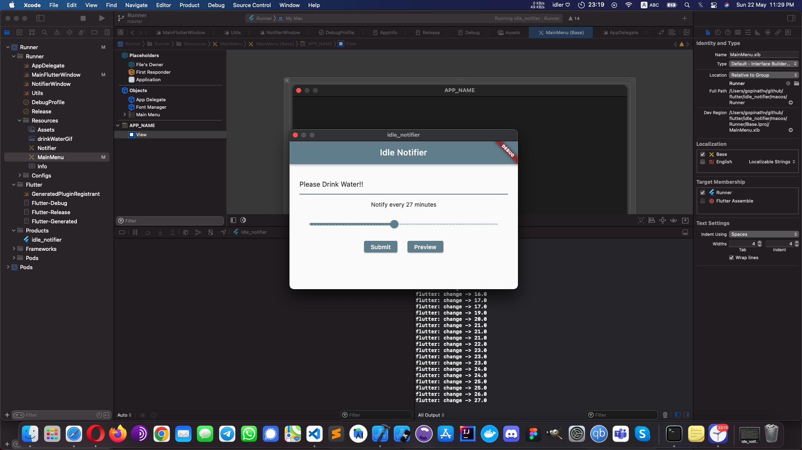
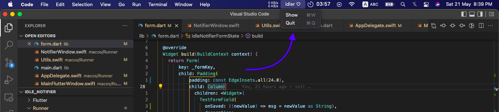
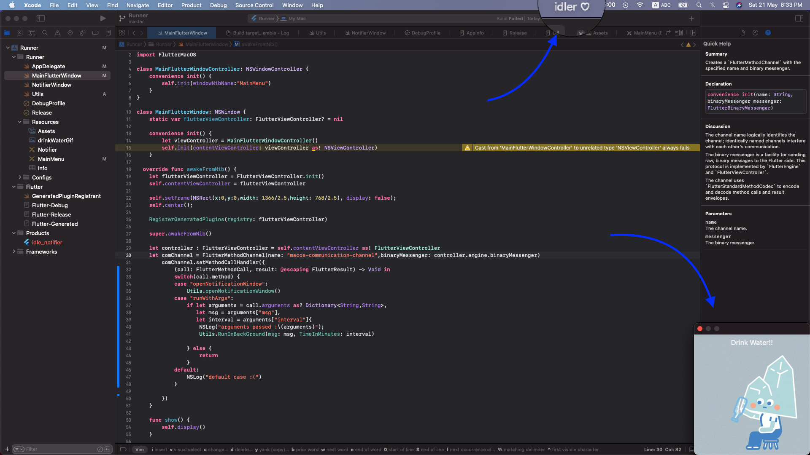
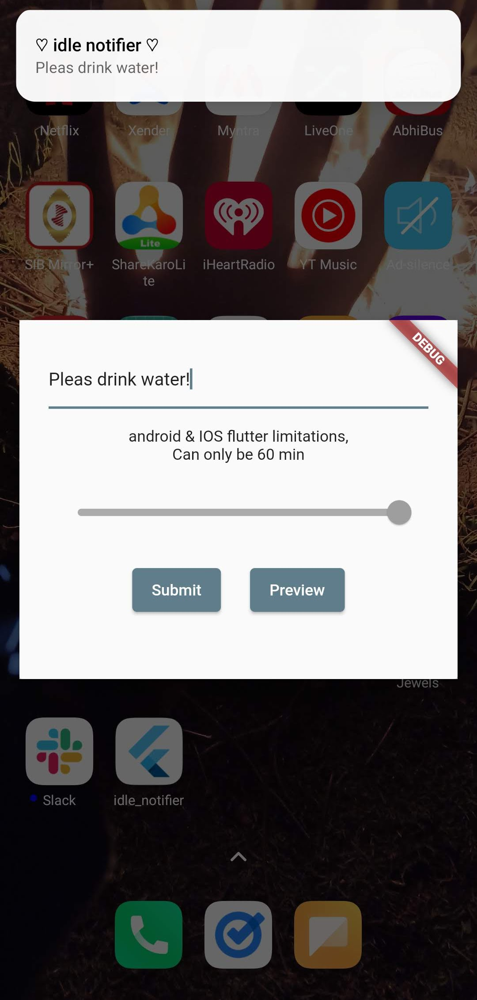
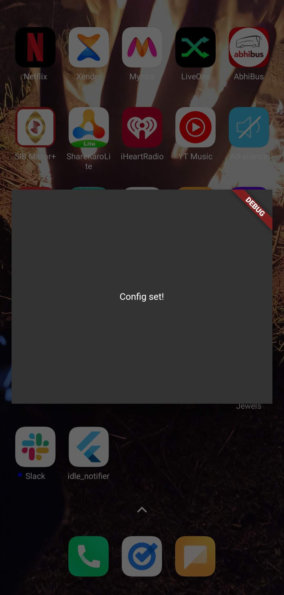
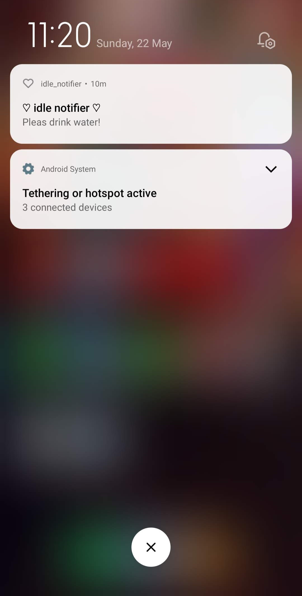

# idler

> Flutter 3.0 Prototype "to remind you to drink water, take a break,...etc"

  
  

[license-badge]: https://img.shields.io/github/license/aghontpi/idler?style=flat-square
[license file]: https://github.com/aghontpi/idler/blob/master/LICENSE
[badge]: https://img.shields.io/github/v/release/aghontpi/idler?include_prereleases&style=flat-square&label=github-release
[release link]: https://github.com/aghontpi/idler/releases

## Reason behind to create this project

To test Flutter 3.0 release.

## Initially built to support

- `macOS`
- `android`
- `iOS`
- `window (pending)`
- `linux (pending)`

## Choosing a usecase that would be useful for every platform

**I sit infront of my computer all day**...I would like to be reminded to take a break every now and then. Most of the time, **I even forget to drink water**.
I want this feature on all platforms.. plus running natively has its benefits. (small footprint, less overhead/fast & minimal usage of system resources to name a few)

## MVP

- minimal UI to get msg & interval from user
- Notify at configured intervals with the given message
- If pc, run in background with no active ui
  - show icon in the system tray/taskbar
  - open a new window with gif in the bottom right corner
- If running on mobile devices
  - run in background after app is closed
  - show the notification with the given message at set intervals

## PC showcase

**Main UI to get the msg & time interval from the user.**

     
    
     
     

**Closing the app, it runs in background.**

     
    
     
     

**Reminder/Alert Window popup with GIF**

     
    
     
     

## Mobile showcase

     
    
    
    
     
     

## Limitations

- Eventhough it supports all platforms...even web(compiles to `Javascript` and runs in browser...) when a feature is not supported, we have to implement this for all platforms.. Note the language to implement the feature for each platform is also different.
  - `macOS`: `Swift`/ `Objective-C`
  - `android`: `Kotlin` /`Java`
  - `iOS`: `Swift`/ `Objective-C`
  - `window`: `c++`
  - `linux`: `c`
- While working in native, each platform has a preferred Editor & each has it own set of tools to work with.
  - for ex: you can write swift code in `visual studio code`..but you are missing out all the features from `xcode`..
- We do the communication between `Dart` and `Native` by using [`platform-channels`](https://docs.flutter.dev/development/platform-integration/platform-channels)
- [pub.dev](https://pub.dev) is not mature enough at the moment..(finding a package that supports all platforms is rare)
  - this is similar to `node modules` in `npm`
- some examples:
  - In my usecase for `macos`,`windows` and `linux`. **I had to open a new window** to show the reminder with a `gif`.. this is not supported in `Flutter` yet. [This feature request is still open since 2019](https://github.com/flutter/flutter/issues/30701).
  - For `Mobiles`.. I decided to **contain the `Flutter` UI in a popup window(image above)**.. this is also not supported in `Flutter` yet.. I spend _COUPLE OF HOURS_ tinkering with different API's. In the end, I achieved the result by implementing it on the `Native` side.
  - & many more... ~sigh

Flutter supports 70-75% of the features to build a production ready app(in a single codebase `Dart`)... but if the feature we want is in the unsupported 25-30% then we have to implment it :) (mutile codebases bason on target platform).

## How did I spend my time coding this?

- Dart & Flutter = 40%
- Researching & Writing native code to support a specific usecase = 40%
- Configuring, Debugging & Understanding devtools = 20%
